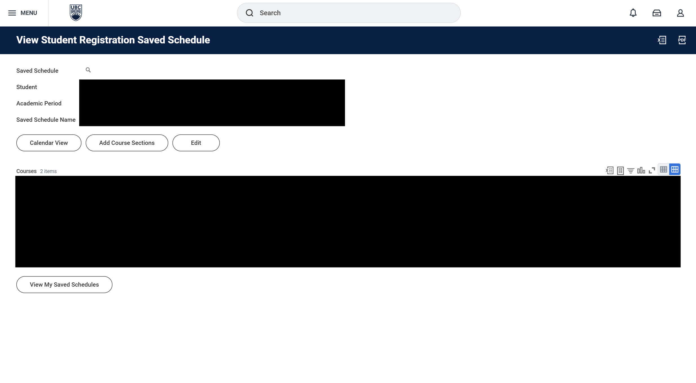

# UBC Single Term Course Sniper

UBC Single Term Course Sniper is a Python script for Windows that automates the process of registering for courses through a Saved Schedule on UBC Workday. It allows users to specify a target time and automatically clicks the registration buttons at that time with millisecond precision.

## Demo

Note: At the time of recording this demo, course registration has already opened. To clarify, this script should be run BEFORE course registration opens.

Video link: https://jmp.sh/5EIghfFU

### ⚠️ **IMPORTANT NOTE** ⚠️

As shown in the demo, you *can* run multiple instances of the script to simultaneously register different schedules. **HOWEVER,** if you have prerequisites for a Term 2 course that you are taking in Term 1, you MUST register the Term 1 schedule first, or else Workday will not allow you to register the Term 2 course.

In this case, use [UBC Dual Term Course Sniper](https://github.com/ExxML/UBC-Dual-Term-Course-Sniper) instead. The Dual Term Course Sniper is designed to register your Term 1 schedule first, then immediately after, your Term 2 schedule.

## Installation

1. Clone the repository.
2. Install Python 3.12.
3. Initialize a virtual environment, then install the required dependencies by running:
```bash
pip install -r requirements.txt
```

## Usage

*Connect to Ethernet for best possible results!*
1. ⭐ **IMPORTANT:** Before running `main.py`, modify the `hour` and `minute` variables to match your course registration time **in PST, as assigned by UBC**. These variables are marked with the comment: `### MODIFY TO MATCH YOUR COURSE REGISTRATION TIME IN PST (24-hour time) ###`. ⭐
2. Run `main.py`. It is recommended to run this program AT LEAST 30 seconds prior to your course registration time. **You will be prompted to run the program as Administrator so that your computer time can be automatically synced.**
3. In the Chrome window that opens, log in to UBC Workday with your CWL.
4. Open the Saved Schedule you want to register.

5. Once you are on this page, press `Enter` in the terminal to start the script.
6. The script will wait until the target time to refresh the page and automatically click the registration buttons.